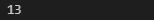

# Latihan List
## Tugas Latihan
- Buat sebuah list sebanyak 5 elemen dengan nilai bebas
```bash
a = [10, 11, 13, 16, 17]
```
### Akses list:
- tampilkan elemen ke 3
```bash
print(a[2])
```
output <P>
- ambil nilai elemen ke 2 sampai elemen ke 4
```bash
print(a[1:4])
```
output <p>
- ambil elemen terakhir
```bash
print(a[-1])
```
output <p>
### Ubah elemen list:
- ubah elemen ke 4 dengan nilai lainnya
```bash
a[3] = 20
print(a)
```
output <p>
- ubah elemen ke 4 sampai dengan elemen terakhir
```bash
a[3:] = [30, 22]
print(a)
```
output <p>
### tambah elemen list:
- ambil 2 bagian dari list pertama (A) dan jadikan list ke 2 (B)
```bash
b = a[0:2]
print (b)
```
output <p>
- tambah list B dengan nilai string
```bash
b.append('belajar')
print(b)
```
output <p>
- tambah list B dengan 3 nilai
```bash
b.extend([100, 30, 21])
print(b)
```
output <p>
- gabungkan list B dengan list A
```bash
b.extend(a)
print(b)
```
output <p>

### full my program
<p>
- Output
<p>
# END