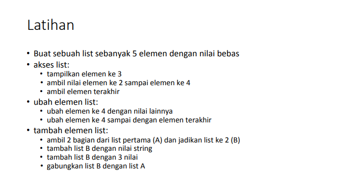

# Owner
_________________________
| Nama  | Ahmad Syukron |
| NIM   | 312110056     |
| Kelas | TI.21.A.1     |

# List Python
[Pratikum](## Tugas Pratikum)
## Tugas Latihan

- Buat sebuah list sebanyak 5 elemen dengan nilai bebas
```bash
a = [10, 11, 13, 16, 17]
```
### Akses list:
- tampilkan elemen ke 3
```bash
print(a[2])
```
output <P>
- ambil nilai elemen ke 2 sampai elemen ke 4
```bash
print(a[1:4])
```
output <p>
- ambil elemen terakhir
```bash
print(a[-1])
```
output <p>
### Ubah elemen list:
- ubah elemen ke 4 dengan nilai lainnya
```bash
a[3] = 20
print(a)
```
output <p>
- ubah elemen ke 4 sampai dengan elemen terakhir
```bash
a[3:] = [30, 22]
print(a)
```
output <p>
### tambah elemen list:
- ambil 2 bagian dari list pertama (A) dan jadikan list ke 2 (B)
```bash
b = a[0:2]
print (b)
```
output <p>
- tambah list B dengan nilai string
```bash
b.append('belajar')
print(b)
```
output <p>
- tambah list B dengan 3 nilai
```bash
b.extend([100, 30, 21])
print(b)
```
output <p>
- gabungkan list B dengan list A
```bash
b.extend(a)
print(b)
```
output <p>

### full my program
<p>
- Output<p>
<p>


## Tugas Pratikum
- Soal<p>

## Program
```bash
#program table data dengan perulangan
nama_list = []
nim_list = []
tugas_list = []
uts_list = []
uas_list = []
rata = []

a = 0
while True:
    nama_list.append(str(input("Nama\t\t : ")))
    nim_list.append(int(input("NIM\t\t : ")))
    tugas = int(input("Nilai Tugas\t : "))
    uts = int(input("Nilai UTS\t : "))
    uas = int(input("Nilai UAS\t : "))
    tugas_list.append(tugas)
    uts_list.append(uts)
    uas_list.append(uas)
    rata.append(tugas * .3 + uts * .35 + uas * .35)
    menambah = input("Ingin menambah data lagi? (Y/T):  ")
    if menambah =="t" or menambah =="T" :
        break
print()
print (68*"=")
print("| {0:^3} | {1:^12} | {2:^9} | {3:^6} | {4:^5} | {5:^5} | {6:^5} |".format("NO", "Nama", "NIM", "Tugas", "UTS", "UAS", "Akhir"))
print (68*"=")
no = 0
for nama, nim, tugas, uts, uas, akhir in zip (nama_list, nim_list, tugas_list, uts_list, uas_list, rata):
    no += 1
    print("| {0:^3} | {1:<12} | {2:>9} | {3:>6} | {4:>5} | {5:>5} | {6:>5} |".format(no, nama, nim, tugas, uts, uas, akhir))
print (68*"=")
```
- <b>Hasil Program</b><p>
<p>
- <b>Penjelasan tentang program</b><p>
Program di atas adalah program list penginputan data dengan Looping/perulangan<p>
untuk perulangan nya sendiri saya juga menggunakan zip, karena saya butuh lebih dari satu iterable maka saya menambahkan zip di program ini<p>
Fungsi zip() mengembalikan nilai sesuai dengan argumen yang diberikan.<P>
<p>

# END